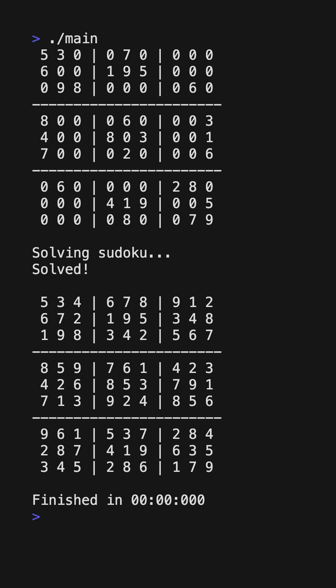
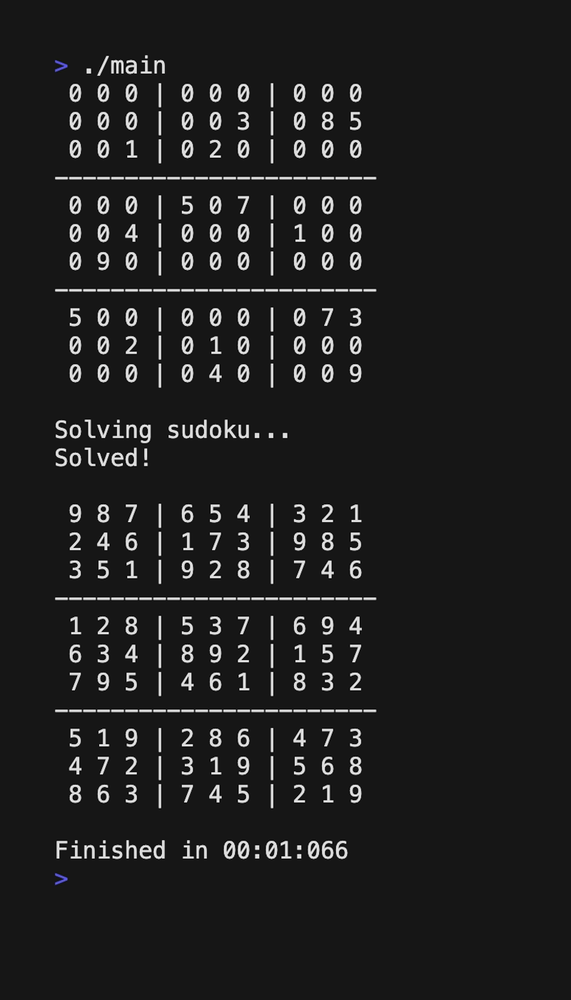

# Sudoku

A sudoku solver that uses a bitboard like grid data structure to efficiently check the validity of potential number placements using bitwise operations. The solver also uses a combination of backtracking and implication based solving to effectively solve sudoku puzzles as fast as possible. (Created May 2019)

# Demo

The solver solves regular 9x9 sudoku puzzles almost instantly.

The solver even solves a puzzle designed to break sudoku solvers in around a second!

Notice the puzzle above starts with 987654321. This is troublesome for many solvers that use backtracking since they guess 1 first, then 2 second, etc. So counting down from nine in the first line of the puzzle results in very slow solving times. However, because of the bitwise operations and implications, my solver can still solve puzzles like this in a very short time. (Note: my solver does not guess random positions in random orders which would also make it seem like the solver was efficient)
